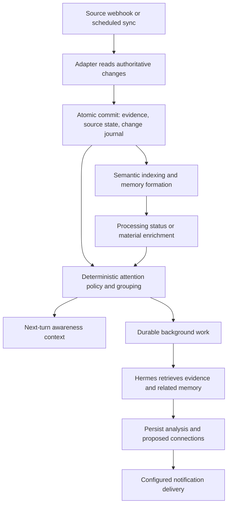

# Memory changes and Hermes awareness: implementation plan

Status: core journal, consumers, foreground packet, Hermes request acknowledgment,
and one-shot/continuous background runner are implemented but opt-in. The host has
not yet been deployed from this workspace. `awareness-run --deliver` dispatches a
model-recommended, administrator-configured notification through Hermes after
revalidating evidence and recording delivery provenance; ambiguous sends remain
durably uncertain and are never retried blindly.
Prepared: 2026-09-16. Target: the current memory framework and the cloned Hermes
`v2026.9.14` integration. Deployment remains on the host running both services.

## 1. Outcome and boundaries

When a source changes, memory must preserve the evidence and give Hermes a reliable
way to notice, inspect, and reason about that change. A new email or WhatsApp message
should become available without an active conversation. Hermes should catch up on
relevant changes during the next conversation and, when configured, in background
runs. Notifications follow the owner's preferences.

Awareness means evidence was supplied to a particular model run or that a run
completed a recorded analysis. It does not mean a model continuously thinks between
runs or that a model's interpretation is verified truth.

The feature must support:

- Historical import, live arrivals, edits, removal, restoration, and sync gaps.
- Multiple adapters, accounts, streams, and simultaneously active Hermes sessions.
- Durable recovery after either memory or Hermes was offline.
- Bounded context, retrieval, model calls, and notification frequency.
- Source-backed interpretation and connections to earlier memories and tasks.
- Independent settings for ingestion, background processing, and notifications.

This plan does not implement new WhatsApp or health adapters. It defines their
shared awareness contract and tests it with a synthetic second adapter. It also
does not change consolidation review policy or grant permission to send replies,
change appointments, or perform other actions described in incoming content.

### Running background analysis

After an administrator enables the journal and configures a background consumer,
run the worker on the same host as Hermes and the memory service:

```sh
personal-memory awareness-run --consumer-id hermes-background --continuous --poll-seconds 60 --deliver
```

The worker checks for pending work before constructing a model, claims one durable
batch at a time, resolves bounded original and related evidence through the memory
retrieval backend, then runs the configured Hermes cron agent with action tools
disabled. It validates the structured result before completion. An invalid result is deferred
with a bounded retry. A process supervisor should restart the continuous worker;
the lease fence prevents a crashed or superseded process from completing stale work.
For a controlled single pass, omit `--continuous`. Omit `--deliver` to analyze
without channel delivery. A notification proposal cannot grant source text authority:
the destination and quiet-hours policy remain administrator configuration, and only
the validated stored result is sent.

## 2. Current implementation and integration points

| Existing code | Current responsibility | Planned integration |
|---|---|---|
| `personal_memory/source_sync.py` | Atomic page commits, source heads, roles, receipts, leases, revision visibility | Write accepted change transitions in the same transaction |
| `personal_memory/source_sdk.py` | Adapter page/operation contract | Optional versioned source event coordinates and classification hints |
| `personal_memory/source_runtime.py` | Service-owned Gmail backfill/live loop and attachment work | Publish progress/gap transitions; provide a generic adapter runner seam |
| `personal_memory/store.py` | Canonical records, source participants, deletion and schema setup | Initialize awareness schema and enforce evidence visibility |
| `personal_memory/semantic.py`, `hindsight.py` | Asynchronous retrieval processing | Expose revision-specific processing state |
| `personal_memory/workflows.py` | Consolidation candidates, quote validation, review | Link formation results to source changes without duplicating extraction |
| `personal_memory/service.py`, `asgi.py`, `tools.py` | Authenticated APIs and Hermes tools | Change reads, claims, completions, status, and capability discovery |
| `personal_memory/provider.py` | Per-turn recall, source exposure lineage, session lifecycle | Bounded awareness context and host-confirmed exposure receipts |
| `personal_memory/reset.py` and recovery/deletion modules | Reset fencing, forgetting, restore | Invalidate stale receipts and remove content from derived artifacts |
| Hermes `agent/memory_manager.py` | Provider prefetch and context assembly | Confirm actual packet inclusion without changing the frozen prompt snapshot |
| Hermes `cron/scheduler.py`, `cron/delivery_queue.py` | Background agent runs and delivery | Execute awareness work through the existing host lifecycle |
| Host patch manifest, contract, and installation checks | Release-pinned integration | Package and test any required optional host hook |

The upstream `source_inbox` currently means “a source signalled that sync is
needed.” It is not a feed of committed memory changes. The provider's conversation
outbox carries observations from Hermes into memory. It is not a reliable reverse
notification channel. Task reminder events remain separate from source changes.

The SDK supports extension, but the current service runtime constructs Gmail and
selects `google.gmail` connections explicitly. Awareness must be adapter-neutral;
general runtime dispatch also needs an explicit extension point before another
adapter can use the same continuous service loop.

## 3. End-to-end behavior



For an appointment change, ingestion records the new email and its source
references. Policy groups it with its thread. A permitted Hermes run retrieves the
email, earlier correspondence, and the relevant task. Its result may explain that
the proposed appointment time changed, with citations to both messages. A
notification is delivered if the owner's rule requests one. Updating the calendar
requires the existing action authorization; noticing a change does not grant it.

For five years of mail, evidence is imported normally while awareness produces
bounded progress/completion digests. Historical mail does not generate thousands
of fresh-arrival alerts. New arrivals during backfill retain their live treatment.

## 4. Core change contract

Introduce `personal_memory/changes.py` as the shared journal and consumer service.
Its transaction-aware append method accepts an existing database connection. It
must not commit independently or invoke a model/network operation.

Each journal entry contains:

| Field | Meaning |
|---|---|
| `event_id`, `sequence`, `schema_version` | Stable identity, monotonic local scan order, contract version |
| `memory_epoch` | Reset boundary; old epoch tokens cannot acknowledge new memory |
| `connection_id`, `source`, `stream`, `partition`, `generation` | Adapter and sync provenance |
| `source_item_id`, `transition_version` | Logical source item and accepted state transition |
| `kind` | Created, content updated, metadata updated, removed, restored, sync gap, backfill progress/completion, material enrichment |
| `origin_mode` | Backfill, incremental, reconcile, or derived processing |
| `novelty` | Historical, confirmed live arrival, recovered arrival, or uncertain discovery |
| `occurred_at`, `observed_at`, `committed_at` | Source chronology, source observation, local persistence |
| `record_ids`, `previous_record_ids` | Current evidence and superseded evidence references |
| `conversation_key`, `entity_ids` | Optional account-scoped grouping references |
| `cause_event_id`, `trace_id` | Link processing results and operational traces to their cause |
| `classification_basis` | Provider coordinates or explicit uncertainty explaining novelty |

Journal entries store references and minimal operational metadata, not copied email
bodies, secrets, attachments, or durable model summaries. Resolve content through
the canonical store at read time, after authorization and visibility checks.
Bound the number of references per entry; large reference sets use a related table
or paginated resolver rather than a silently truncated event.

Event identity must describe a real state transition. Hashing only the body is
insufficient: remove -> restore -> remove is three transitions even if content is
unchanged. Persist a per-item transition counter or equivalent durable version.
An identical accepted state is a no-op; retrying its page does not create an event.

### Atomicity and ordering

Extend `SourceSync._apply_operation` to describe the before/after state of each
accepted logical operation. Append its change while `commit_page` still holds the
same transaction as canonical evidence, source heads, and the page receipt.

- Rollback leaves neither evidence nor its change notification committed.
- A replayed page returns its receipt without appending again.
- Rejected old revisions, forgotten items, and skipped operations do not produce
  fresh-arrival events.
- A logical email split into several canonical records produces one logical change
  with all evidence references; representation chunks are not separate arrivals.
- Metadata changes are classified separately. Label/read-state churn normally
  updates status without waking the model.
- Source removal respects archive versus mirror retention. “Removed upstream” and
  “forgotten from memory” remain different operations.

### Historical versus genuinely new data

An incremental sync pass is not proof that an item was just received. Providers
can replay old objects or report metadata changes. Use provider arrival/history
coordinates and the connection's initial live boundary where available. Keep
timestamps as supporting evidence, not the sole ordering authority.

If backfill stores an item before incremental sync confirms it arrived after the
live boundary, refine its classification through a linked transition. Deduplicate
the attention item by logical arrival identity so exactly one arrival is scheduled.
Do not lose the live arrival because backfill happened to win the database race.

Expired-history recovery records an explicit gap. Items first discovered during
reconciliation are recovered/uncertain unless source evidence proves otherwise.
They can enter a catch-up digest without being falsely described as just received.

## 5. Storage and delivery state

Add schema-managed tables with migration tests:

| Proposed table | Responsibility |
|---|---|
| `memory_changes` and reference table | Ordered immutable transition metadata |
| `awareness_consumers` | Server-bound owner/profile/purpose and scan position |
| `awareness_batches` and membership | Durable bounded work, event membership, frozen high-water mark, lease/fence |
| `awareness_receipts` | Packet supplied to a host turn, processing completion, suppression/defer decisions |
| `awareness_results` | Source-dependent analysis, citations, proposed relationships, policy/model versions |
| `awareness_deliveries` | Notification intent, destination binding, attempts, delivery receipts and uncertainty |

Reuse the established lease/fence/retry conventions, but do not overload source
attachment jobs, conversation capture entries, or task reminders with new meanings.
Extract shared queue helpers only where their state semantics really match.

Use at-least-once processing with idempotent completion. Claim returns a lease,
fencing token, epoch, batch ID, and membership digest. Completion validates these
and atomically stores the result, marks membership handled, and creates any
notification intent. A failed/stale completion cannot skip work.

The global scan cursor advances only after eligible work has been durably
materialized or explicitly suppressed/deferred. Processing completion is tracked
per batch. This allows later urgent work to run without losing earlier pending work.
Do not advance a cursor merely because a feed page was read or a claim was issued.

Keep distinct state for:

- A particular foreground session/turn receiving a packet.
- The owner/profile background consumer completing an analysis.
- A notification reaching its intended destination.

One session's packet receipt must not erase another session's pending context or
mark a background analysis complete. Coalesce user notifications at the profile
level to prevent several sessions announcing the same event.

## 6. Attention policy and context budgets

Introduce `personal_memory/awareness.py` for deterministic policy evaluation,
grouping, batching, and accounting. Operator configuration controls which sources,
event kinds, contacts, conversations, and destinations are eligible.

The first implementation supports four decisions: record only, include in next-turn
context, enqueue a background digest, or request a prompt background run. These
decisions are distinct from delivery to the user.

Proposed initial defaults, configurable and subject to measurement:

| Setting | Initial proposal |
|---|---|
| Feature activation | Disabled until explicitly enabled during deployment |
| Next-turn packet | Up to 8 groups, approximately 1,000 tokens; explicit omitted count |
| Background grouping | 5-minute window, at most 20 groups or approximately 6,000 input tokens per run |
| Model concurrency | One awareness run per profile initially |
| Related-memory lookup | At most 2 retrieval rounds per run, bounded shared evidence budget |
| Idle behavior | No LLM call when no eligible work exists |
| Historical events | Progress/completion digest; no per-item arrival notifications |
| Metadata-only changes | Record/status only unless an explicit rule matches |
| Notification delivery | Disabled until destination and policy are configured |
| Urgent rules | Explicit rules; quiet-hours behavior must be configured |

Measure tokens with the active model tokenizer when available. Otherwise enforce a
conservative byte/character cap and label token counts as estimates. Byte limits
must also protect API and subprocess payloads. Overflow stays pending or is
represented by a count, never acknowledged as fully analysed.

Group email by account + thread ID, chat by account + conversation, and measurements
by source + metric + time window. Update a group's version when more evidence arrives.
A claimed batch has frozen membership; arrivals during processing belong to a
subsequent batch. Never silently mutate the input to an in-flight model run.

Use source-linked entities and existing task IDs for relevance. Do not merge people
across accounts merely because their names match. A sender's “urgent” wording can
be evidence for analysis, but cannot install policy or grant action permissions.

Reuse already available consolidation/Hindsight evidence where useful, while
preserving its verification status and citations. Exact quoted snippets and
deterministic sender/thread metadata should handle basic updates without an extra
summarization call per message. Persist completed batch analyses so foreground
sessions can reuse them rather than calling the model again.

## 7. APIs and tool surface

Add versioned routes and advertise them through service capability discovery.
Names below are proposed contracts, not currently available endpoints.

| Route | Contract |
|---|---|
| `POST /v1/changes/read` | Authorized, paginated inspection; cursor, filters, limit, byte budget; no processing acknowledgment |
| `POST /v1/awareness/prepare` | Build/reuse a bounded foreground packet for a trusted session/turn identity |
| `POST /v1/awareness/exposed` | Host confirms packet inclusion in an actual request; idempotent packet/turn receipt |
| `POST /v1/awareness/claim` | Lease durable background work for an authorized consumer |
| `POST /v1/awareness/complete` | Persist validated result and finish leased work atomically |
| `POST /v1/awareness/defer` | Record retry/defer with bounded reason and next eligibility |
| `POST /v1/awareness/status` | Backlog, cursor lag, processing state, failures and delivery status |
| `POST /v1/awareness/configure` | Administrator policy/destination configuration and explicit replay scope |

Read responses include `events`, `next_cursor`, `scanned_through`, `high_watermark`,
`has_more`, and `gap/resync_required`. Cursors are opaque and scoped to principal,
filter digest, and memory epoch. Page limits must not equate “returned no visible
events” with “there is nothing later to scan.”

Consumer IDs and profile/source access come from trusted service/host identity.
They are not arbitrary values chosen by an email or an agent tool argument.
Foreground exposure endpoints are host operations, not model-callable tools.
Grant the background worker narrowly scoped claims/completions and evidence reads;
do not broaden the existing scheduler role to unrestricted personal-memory access.

Extend the existing `personal_memory_knowledge` hub with read operations such as
`changes` and `awareness_status`, including clear schema discovery. Keep policy
administration and delivery receipts outside the ordinary agent write surface.
“What new mail arrived?” should support source/date filters and report sync gaps.
“What changed since I last talked to you?” uses the relevant session/profile receipt,
not the email's read/unread label.

## 8. Foreground Hermes integration

Use the existing per-turn recall path to add a bounded awareness packet alongside
query-related memory. Do not rewrite Hermes's frozen system-prompt snapshot or
stuff arrivals into curated MEMORY.md/USER.md.

1. Verify primary/private session scope using the existing provider boundary.
2. Fetch/reuse a packet under the existing bounded context deadline.
3. Include source references, timestamps, novelty, readiness and any reused analysis.
4. Mark it as untrusted memory evidence; explicitly show partial coverage.
5. Record exposure lineage for every source included in that packet.
6. Confirm exposure only after the host includes the packet in an actual model
   request. Prefetch alone is insufficient: it can time out or finish after the turn.

Inspect the actual request-assembly call sites before choosing the smallest optional
host callback for step 6. `on_turn_start` currently captures user input; it does not
prove provider context was included. A supplied packet also does not prove model
comprehension. Record “supplied to request” precisely.

Treat repeated model/tool steps within one user turn as the same exposure unless
the packet changes. Revalidate pending packet references after a correction,
forget, or reset. Invalidate awareness caches by event/version/epoch independently
of the existing query-only prefetch cache so arrivals can appear even when a user
repeats the same question.

Older hosts that lack the optional acknowledgment hook retain explicit change
reads and may receive non-destructive pending context. They must not falsely
advance exposure state. Capability/status output makes this limitation visible.

## 9. Background Hermes integration and delivery

Memory owns the durable pending work. Hermes owns the actual agent run, its normal
tool permissions, model configuration, execution lifecycle, and delivery channel.
Do not create a second independent agent implementation inside the memory service.

Use one host scheduler entry per enabled profile, with an inexpensive pending-work
check before model initialization. A `no_agent` job can check/dispatch work but
cannot itself reason about email. The actual processing path must enter an ordinary
Hermes agent run with an approved private profile identity and batch references.

Start with scheduler polling and an on-startup catch-up. Add a local authenticated
wake hint for urgent work only after the scheduler path is reliable. A wake hint
merely asks the same consumer to claim its durable work; losing or duplicating the
hint cannot lose or duplicate completed processing. Debounce wake requests.

Each run retrieves its frozen batch and relevant current memories, then returns a
structured result containing summary, cited evidence, proposed links/task changes,
notification recommendation, and any insufficient-evidence status. Validate
references, source visibility, and result size before committing it. Proposed
facts follow existing review policy; model recommendations do not override owner
notification rules.

Persist result dependencies so corrections/deletion invalidate stale digests and
queued notifications. Generated analyses and their later capture must carry origin
and cause links. They cannot generate an endless cycle of “new external message”
awareness events.

For notifications, create a durable intent with a stable idempotency key covering
profile, destination, policy decision, and analysed group version. Reuse Hermes's
delivery facilities and explicit destination binding. Revalidate evidence and
policy before sending. Track queued, attempted, confirmed, failed and uncertain.
Exactly-once external delivery cannot be promised when a channel lacks idempotency
and a process dies after sending but before recording the receipt. Such a case
must be surfaced as uncertain rather than blindly resent.

New source polling latency remains part of the user-visible delay. The present
Gmail default is 300 seconds; a wake mechanism cannot notice mail before sync has
fetched it. Report capture, attention, model, and delivery latency separately.

## 10. Processing readiness and dependency changes

Arrival events are published once canonical evidence commits. Foreground and
background consumers can retrieve originals immediately without waiting for all
optional processing engines.

Expose per-record-revision states for canonical storage, semantic index, Hindsight,
consolidation, and review. Use explicit values such as disabled, pending, running,
ready, failed and partial. Hindsight retained, semantic indexed, and consolidation
candidate are different states; none implies verified understanding.

Readiness should be derived from authoritative existing processing state where
possible. If an engine lacks durable per-revision status, add a small projection
updated with its completion record and reconciled on restart. Whole-record
consolidation readiness must account for all scheduled source spans.

Routine stage completions update status without another user alert. A genuinely
new, source-backed connection can create a linked material-enrichment event.
Notification policy deduplicates that against earlier delivery and sends a follow-up
only when configured and materially different. Disabled/failed optional engines
must not block awareness indefinitely.

## 11. Privacy, reset, retention and compatibility

- Reuse existing owner/private-session authorization and origin/lineage tracking.
  Unknown/shared sessions cannot receive private awareness packets.
- Recheck current record visibility and deletion status during preparation,
  retrieval, completion, and delivery. Deletion cancels pending work and scrubs or
  invalidates stored analysis containing forgotten evidence.
- Source disconnection stops future capture. Explicit configuration decides
  whether already captured pending attention should finish; default to pausing it
  until the owner resumes/replays it.
- Memory reset increments the epoch and fences every old lease, cursor and packet.
  Old background work cannot recreate forgotten facts or send stale notifications.
- Backup/restore includes awareness state. Reconcile current deletion ledgers and
  delivery receipts before dispatch after restore. A database restored from an old
  backup cannot safely assume a notification was never sent.
- Journal retention cannot silently erase a slow consumer's unread range. Pin
  unprocessed ranges up to an operator storage limit; on forced compaction return
  an explicit gap and build a bounded resync digest.
- Migrations are additive. Existing adapter operation formats remain valid; new
  hints are optional/versioned. Awareness disabled leaves ingestion behavior intact.
- On upgrade, initialize the live consumer at a transactionally recorded boundary.
  Existing stored mail is available for one explicit catch-up digest; it is not
  replayed as live arrivals. Concurrent arrivals after the boundary remain pending.
- No broker or external queue is required for the first implementation. SQLite
  remains the authoritative transactional boundary.

## 12. Observability and operational controls

Expose counts and latency without logging message bodies or credentials:

- Captured changes by source/mode/kind; live versus historical versus uncertain.
- Last source sync, coverage gaps, scan backlog and oldest pending attention age.
- Foreground packets prepared versus supplied; background claims and completions.
- Model input/output tokens, calls per batch, reused results and budget deferrals.
- Suppressed/deferred reason counts, retries, expired leases and quarantine.
- Readiness by processing engine, notification delivery and uncertain outcomes.

Provide doctor checks for host hook compatibility, consumer health, polling
configuration, disabled stages, stale indexes and destination configuration. Add
bounded administrator replay/retry with a dry-run count. Replays should default to
reprocessing analysis without re-sending previously delivered notifications.

## 13. Implementation phases and acceptance gates

| Phase | Deliverables | Exit condition |
|---|---|---|
| 1: Journal and classification | Schema migration, atomic append, transition identity, backfill/live race handling, read/status API | Crash/replay tests pass; historical import produces no fresh-arrival storm |
| 2: Consumers and attention | Scoped consumers, leases, frozen batches, policy/grouping/budgets, completion transaction | Offline catch-up and concurrent worker tests pass with no lost events |
| 3: Foreground awareness | Provider packet, visibility/lineage/cache integration, optional host exposure callback | Actual Hermes request includes new data once per applicable turn; a dropped prefetch is not acknowledged |
| 4: Background awareness | Existing Hermes scheduler dispatch, constrained agent run, structured analysis, result reuse | Idle checks use no LLM; repeated dispatch completes one logical analysis |
| 5: Delivery and enrichment | Owner-configured destinations, durable intents, readiness projection, material follow-ups | Policy, dedupe, correction and uncertain-send tests pass |
| 6: Qualification and rollout | Scale tests, real local-model evaluation, migration/restore checks, operator docs | Measured limits and remaining gaps published; deployment can be enabled incrementally |

Package optional host changes in the active release-pinned patch, update manifest
hashes and packaged contract together, and rerun apply/reapply/rollback/local-edit
protection checks. Do not rely on an untracked modification to the cloned Hermes tree.

## 14. Test matrix

Use synthetic fixtures by default. Real mailbox/model trials are isolated and
produce content-free reports. Each case must assert durable state and observable
behavior, not merely that an internal helper was called.

| ID | Scenario | Required result |
|---|---|---|
| J01 | Crash before page commit | Neither records nor events/cursor advancement survive |
| J02 | Crash after commit before acknowledgment | Replay returns one committed logical transition |
| J03 | Duplicate webhook and repeat source page | No repeated arrival or analysis intent |
| J04 | Out-of-order old revision | Current memory unchanged; no fresh-arrival event |
| J05 | Remove -> restore -> remove | Three distinct transitions, retries deduplicated |
| J06 | Long message becomes multiple records | One logical arrival; all parts remain accessible |
| J07 | Metadata-only/read-label update | Status changes without ordinary model wake |
| J08 | Forgotten item reappears upstream | Suppressed without content or notification resurrection |
| N01 | Five-year historical import | Bounded progress/completion digest, zero per-item live alerts |
| N02 | New mail while backfill runs | Live event appears once regardless of which worker stores it first |
| N03 | Historical item appears in incremental results | Classification uses source evidence, not pass role alone |
| N04 | Expired source history | Explicit gap; rescan discoveries are not falsely labelled fresh |
| N05 | Incorrect/future/missing source date | Stable ordering and explicit novelty uncertainty |
| C01 | Crash while consumer owns lease | Lease expires; work can be reclaimed |
| C02 | Old worker completes after lease reassignment | Fence rejects completion and delivery creation |
| C03 | Two foreground sessions plus background consumer | Independent exposure and processing state |
| C04 | Read-only feed inspection | Does not acknowledge processing or user notification |
| C05 | Out-of-order batch completion | Scan state preserves unfinished earlier work |
| C06 | New events during claimed batch | Existing membership fixed; new work remains pending |
| C07 | Filtered/hidden events and sparse sequence numbers | Pagination makes progress without skipping visible work |
| C08 | Cursor used with another owner/filter/epoch | Rejected without leaking event counts or content |
| C09 | Forced journal compaction past a consumer | Explicit gap and resumable catch-up digest |
| F01 | New item unrelated to current query | Awareness hint can still appear within policy/budget |
| F02 | Same query after arrival | Awareness cache refreshes independently of query cache |
| F03 | Prefetch times out or finishes after request assembly | No false exposure acknowledgment |
| F04 | Multiple model/tool steps in one turn | Stable packet identity avoids repeated announcements |
| F05 | Shared/unknown session | No private source context |
| F06 | Older host missing optional hook | Existing recall works; exposure limitation is visible |
| B01 | Empty queue | Zero model invocations |
| B02 | Burst of 1,000 related messages | Bounded grouping, eventual processing, no silent overflow loss |
| B03 | High-volume source alongside a small urgent source | Fair scheduling prevents starvation |
| B04 | Model timeout/invalid output | Bounded retry/quarantine, no false completion or notification |
| B05 | Valid source-linked analysis replay | One stored logical result, reusable by foreground sessions |
| B06 | Conflicting identities or dates | No automatic identity merge or unsupported certainty |
| B07 | Source text instructs sending/deleting data | Treated as evidence; cannot alter policy or tool permissions |
| B08 | Captured background analysis returns to memory | No self-triggering awareness loop |
| R01 | Semantic/Hindsight disabled or failing | Original evidence remains available; readiness is accurate |
| R02 | Partial consolidation of a long source | Partial status rather than whole-source ready |
| R03 | Routine index completion | No duplicate arrival notification |
| R04 | Material new connection after initial analysis | Linked enrichment, policy-gated follow-up with citations |
| D01 | Quiet hours and configured urgency | Only explicit policy may bypass quiet hours |
| D02 | Multiple sessions choose same notification | One logical delivery intent |
| D03 | Crash before send | Safe retry of persisted intent |
| D04 | Crash after send before receipt | Channel idempotency or explicit uncertain state |
| D05 | Delete/correct source while delivery queued | Revalidate, cancel or regenerate stale content |
| D06 | Retry analysis after previous notification | Does not resend unless explicitly requested |
| L01 | Forget and reset during active processing | No result, cached snippet or old lease restores forgotten data |
| L02 | Restore backup older than a delivery | Reconcile receipt state; no blind resend |
| L03 | Enable feature over an existing large archive | Atomic starting boundary, optional catch-up, no live flood |
| L04 | Adapter pause/disconnect/reconfigure | Explicit pending-work behavior; old generation cannot claim new scope |
| X01 | Synthetic second adapter uses shared feed | No Gmail-only assumptions in journal/policy/consumer code |
| X02 | Actual pinned Hermes foreground run | Verify packet in actual model request and exposure lineage |
| X03 | Actual pinned Hermes background run | Verify claim -> retrieval -> analysis -> durable completion |
| X04 | Host patch apply/reapply/rollback | Hash-pinned behavior and local-edit protection preserved |

## 15. Performance and live qualification

Benchmark at least 50,000 historical items plus a concurrent live stream, approximating
the current mailbox scale. Include slow model processing, retries, service restarts,
and a bursty second source. Measure ingestion throughput with awareness disabled and
enabled on the same fixture. Initial target: no network/model work in the commit
path and less than 10% throughput regression; publish actual results before treating
that target as met.

Measure p50/p95 commit-to-feed visibility, pending age, packet preparation time,
tokens per processed group, and wake-to-run latency. Foreground awareness shares the
existing bounded recall deadline; a backlog must not turn every user turn into a
long synchronous catch-up. Choose SQLite indexes using the measured query plans.

Use the configured local model for a small reviewed evaluation set covering new
mail, a changed appointment, conflicting messages, old discoveries, irrelevant
newsletters and instructions embedded in source text. Score citation correctness,
unsupported assertions, missed relevant updates, unnecessary alerts, and tokens.
Schema-valid extraction alone is not a passing answer-quality result.

Roll out first with journal/status only, then foreground packets, then silent
background analysis, and finally explicitly configured notifications. Compare
captured, presented, processed and notified counts at each stage. Keep ingestion
working if awareness is disabled or a model is unavailable.

## 16. Decisions to settle at deployment

Implementation can proceed with the proposed configurable defaults. Before enabling
live notifications, record the owner's destination, timezone/quiet hours, urgent
rules, and digest preference. Also choose which historical catch-up scope to analyse
and the local model budget. These choices do not require redesigning adapters or
the journal.

Completion means the core feed, both Hermes consumption paths, deletion/recovery
behavior, and bounded-cost tests pass on the pinned integration. Full production
activation requires the code to be deployed to the actual Hermes host and the
configured policies to be exercised there.
