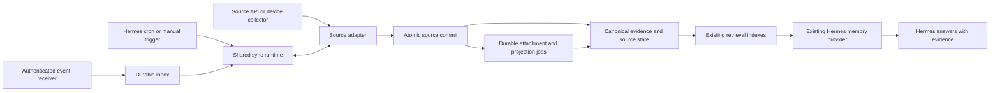

# Extensible source ingestion for Hermes

Status: proposed design; no runtime implementation in this change.
Implementation work packages, feature scope, and acceptance tests are specified
in [SOURCE_ADAPTER_IMPLEMENTATION.md](SOURCE_ADAPTER_IMPLEMENTATION.md).
Reviewed 2026-09-16 against memory-framework `281088f` and Hermes `v2026.9.14`
(`345cd2b`). Repository findings below are static code observations, not live
Gmail or deployment test results.

## Requirement and decisions

Run ingestion on the host that runs Hermes and the memory framework. Start with
Gmail using the owner's OAuth application. Content may be processed by the
owner's local LLMs and embedding models. Support later adapters for chat exports,
live messaging, health data, files, and other sources.

Every connection must support the subset of these capabilities its upstream
actually provides: historical import, incremental updates, event delivery,
reconciliation, attachments, updates, and deletions. Missing capabilities must
be explicit. An adapter cannot recover history that the upstream no longer has.

Proposed Gmail defaults, pending confirmation: five years of accessible mail,
including Sent; exclude Spam and Trash from the initial scope; poll every five
minutes; ingest quietly. Import scope, latency, mailbox size, attachment policy,
and source-deletion retention remain decisions to finalize. The initial import
is the accessible mailbox within that scope, not every email ever received.

## Existing foundations and actual gaps

| Area | Current code | Consequence for implementation |
| --- | --- | --- |
| Record contract | `personal_memory/ingestion.py`: strict 1.0 envelope, immutable identity/revision, participants, provenance, namespaced extensions | Preserve this public contract. Add a sync protocol around it. |
| Adapter SDK | `IngestionConnector.read(checkpoint)` and `submit()` | Useful parser boundary; no shared connection lifecycle. `submit()` sends one record per request and does not submit atomic checkpoints. |
| Atomic delivery | `Store.ingest()` accepts a checkpoint with `expected_cursor`; record writes and cursor commit share a transaction | Reuse the storage implementation. Existing scope is `(connector_id, source)`; add stream/partition state without changing old callers. |
| Checkpoint edge cases | Existing ingest requires 1–100 records; replay checks bind the target cursor to a batch hash | Cannot commit an empty delta page or a deletion-only page through the existing record API. Do not manufacture records to advance a cursor. |
| Source versions | New revisions coexist; `Store.supersede()` is a separate operation | Need an atomic current-version transition so out-of-order backfill cannot replace a newer live version. |
| Deletions | `forget_source()` permanently blocks future revisions | User-requested forgetting is different from an upstream deletion, a Trash move, or leaving a selected folder. |
| Credentials | `MemoryService.authorize()` scopes ingest credentials to connector/source; blob writes are scoped | Extend with narrowly scoped sync operations. Existing ingest credentials cannot call supersede, forget, coverage writes, or typed measurement writes. Do not give every adapter an admin token. |
| Attachments | `personal_memory/blobs.py`: resumable, hashed storage inside the backup/deletion boundary | Reuse it; add durable download/projection obligations and distinguish stored bytes from searchable attachment text. |
| Export importers | `personal_memory/importers.py`: EML/MBOX, WhatsApp text, health CSV | Wrap and improve these as adapters. Email exports currently use Message-ID and list attachment names; attachment bytes are not imported by that parser. |
| Knowledge | Participants/identity links, semantic retrieval, structured measurements and relations already exist | Preserve source evidence; add explicit, replayable domain projections where needed. Arbitrary extension JSON does not automatically create searchable graph edges or measurements. |
| Coverage | `Store.coverage()` stores coarse source state; domain coverage serves another purpose | Add per-stream ranges, filter identity, live lag, gaps, and stage readiness. A cursor is not proof of complete history. |
| Indexing | Semantic and Hindsight workers already run independently of ingestion | Reuse them. Qualify priority and throughput under a large backfill so live records do not sit behind years of indexing. |
| Hermes scheduling | `cron/scheduler.py:_run_no_agent_job()` runs scripts without constructing an agent | A thin scheduled command can trigger ingestion without a model call. |
| Hermes webhooks | `gateway/platforms/webhook.py:_handle_cron_trigger()` creates an in-process task and immediately returns 202; deduplication is in memory | This path alone is not a durable inbox. Use a durable ingestion receiver or Pub/Sub pull consumer. |
| Hermes extension surface | `hermes_cli/plugins.py:PluginContext.register_cli_command()` and skills | Provide one management CLI and an adapter-authoring skill; avoid a permanent tool schema for every source. |

`docs/INGESTION.md` correctly describes generic `submit()` as lacking durable
delivery, but its checkpoint discussion should be expanded when this is built:
the service already supports atomic record/checkpoint commits.

## Architecture and ownership

The memory framework owns the generic correctness machinery: connection and
stream state, leases, replay, current-version visibility, retention, coverage,
scoped authorization, and durable jobs. Provider-specific packages own API calls,
pagination, version semantics, event verification, and faithful normalization.
Hermes manages connections through the CLI and retrieves through its existing
memory provider.

Run a supervised ingestion worker alongside the memory service. Keep network
calls, parsing, and local-model work outside SQLite write transactions. Start
with the existing SQLite deployment; short bounded commits and controlled
worker concurrency are appropriate until measurements show otherwise.

Reuse existing workflow/runner and indexing infrastructure where its contracts
fit. Ingestion state must not be represented as learning proposals or native
conversation captures. Factor shared lease/retry utilities if necessary; avoid
creating another independent scheduler. Hermes cron can enqueue due work;
manual runs, recovery on worker startup, and event triggers use that same queue.

Adapters distributed as separate packages avoid adding Gmail/WhatsApp-specific
dependencies or branches to the memory core. A filesystem or device adapter can
use the same protocol without Python inheritance.

## Adapter contract

Keep record schema 1.0 unchanged. Introduce a separately versioned adapter
protocol with the following conceptual operations; these names are proposals,
not commands or APIs available today.

| Operation | Responsibility |
| --- | --- |
| `spec()` | Adapter/version, config schema, secret references, supported protocol versions, source capabilities and limitations |
| `check(connection)` | Validate authentication, upstream account identity, permissions, and prerequisites without importing data |
| `discover(connection)` | Available streams, partitions, record kinds, history limits, and required permissions |
| `read_page(context, state)` | Bounded records/change operations, opaque next state, page completion and coverage evidence; mode is backfill, incremental, or reconciliation |
| `normalize(item)` | Deterministic 1.0 record(s), source version information, relationship coordinates, attachment descriptors, projection inputs |
| `fetch_attachment(reference)` | Stream bytes with size/hash checks and resumable delivery where supported |
| `verify_event(request)` | For webhook-capable adapters, verify the provider-specific authentication and decode a bounded signal/event |
| `maintain_subscription(state)` | For subscription-capable adapters, create/renew subscriptions using persisted expiry |
| `migrate_state(old_version, state)` | Explicit upgrade or a declared rescan requirement; never silently reinterpret an opaque cursor |

Prefer one page-reading contract over separate unrelated backfill/live parsers.
Existing `IngestionConnector` implementations get a compatibility wrapper and
can remain export-only until they implement additional capabilities.

A manifest declares supported operations rather than forcing every source to
implement fake webhooks, deletes, or historical access. HTTP retry, rate-limit
handling, secret resolution, job ownership, and commit logic live in the runtime.
Use provider SDKs where useful. Singer's documented replay and partitioned-state
patterns are relevant prior art; a Singer bridge can later reuse existing
extractors while still supplying our provenance and domain mapping.
See [delivery semantics](https://sdk.meltano.com/en/v0.44.0/implementation/at_least_once.html)
and [partitioned state](https://sdk.meltano.com/en/v0.50.1/implementation/state.html).

## Identity, versions, and transactions

Separate these concepts:

- **Adapter:** implementation, such as a Gmail connector package.
- **Connection:** one authorized upstream account with an immutable local ID.
- **Source:** stable account-specific evidence namespace, preserved on reauthorization.
- **Stream/partition:** independently resumable subset, such as mailbox changes or a historical time window.
- **Source item:** provider identity within that account; never an import timestamp.
- **Revision:** immutable content representation; separate from sync cursor and arrival order.

Persist proposed tables for connections, stream state, inbox events/pages, run
leases, source-item heads, page receipts, coverage ranges, and processing jobs.
Store authoritative progress and canonical records in the same `memory.db`
transaction boundary. Secrets remain in protected host storage; tables/config
hold references. Include these new tables in backup, restore, and reset behavior.

Add a source-scoped commit operation that can atomically:

1. Validate connection, stream, lease fencing token, expected state version, and
   memory reset epoch.
2. Validate and insert records using the existing canonical ingestion logic.
3. Apply explicit source operations: update current revision, record removal or
   restoration, update mutable source metadata, or record a policy skip.
4. Record required attachment/projection jobs and scoped coverage observations.
5. Commit the page receipt and new cursor/state version.

An empty delta page must commit progress with zero records. A page with only
deletions must also be valid. Bind replay receipts to a stable operation ID and
payload digest; reusing an ID with different contents is a conflict. Use an
internal transaction-aware ingestion function, not nested calls that each
commit separately.

If an upstream page exceeds local batch/body limits, split it into bounded
sub-batches with durable page progress. Advance the upstream completion cursor
only after every item has a durable outcome. A source cursor must never jump
over an uncommitted page tail.

Provider version tokens are opaque unless the adapter explicitly defines their
ordering. Content hashes detect equality, not chronology. Older backfill can add
historical evidence but cannot replace a newer head. Where an API offers no
comparable version, serialize item updates and reconcile against current source
state; declare weaker historical guarantees instead of using arrival time.

Keep source metadata such as read/unread state separately when it is outside
the immutable content representation. If an adapter includes a field inside a
1.0 record, changing it requires a new revision. Connector upgrades alone should
not duplicate all source content; changed normalization gets an explicit version
and controlled reprocessing path.

## Delivery and recovery rules

Use at-least-once delivery with idempotent canonical effects. Do not claim
end-to-end exactly-once delivery across provider APIs, attachments, and models.

- Acknowledge an incoming event only after it has reached a durable inbox.
  Signals can coalesce into a single "sync needed" marker; keep a generation
  counter so an event arriving during a run cannot be lost when that run ends.
- Treat notifications as triggers to fetch authoritative changes when the source
  supplies a change feed. For event-only sources, persist the actual payload and
  report any upstream replay limits.
- Keep fetched state distinct from applied state if pages are staged. A fetched
  cursor may advance only with its complete durable page; an applied cursor
  advances only after canonical outcomes commit.
- Lease work per stream/partition with an expiry and monotonically increasing
  fencing token. A worker that resumes after losing its lease cannot commit.
- Respect provider retry hints, use bounded backoff with jitter, and separate
  temporary failures from revoked credentials, expired cursors, and invalid data.
- Quarantine malformed items with replayable source identity and a visible gap.
  Never mark a range complete after silently dropping an item. Fetch progress may
  continue only if the outstanding obligation is durable and independently retryable.
- Distinguish authoritative deletion from temporary 404s, denied permissions,
  moves, and filter changes. Reconciliation only retires missing items after a
  complete, successful enumeration under the same account and scope.
- On reset or connection removal, cancel/fence in-flight work and reject stale
  commits. Resume/rescan must be explicit so a reset does not silently refill memory.

## Gmail implementation

Use read-only mailbox authorization. Store OAuth refresh material on the host;
do not pass credentials through memory records, prompts, or logs. OAuth client
type and host reachability determine whether setup uses a loopback callback,
an SSH-forwarded callback, or an application redirect. Collect those deployment
details during setup; no credentials are needed to review this plan.

Use the same account namespace and provider message IDs for both import and
incremental sync. Gmail documents immutable message IDs, thread IDs, a message
history ID, and separate internal timestamps. Preserve RFC headers as evidence
and linking coordinates; Message-ID alone is not the storage key for an API
connection. Preserve Date and provider time with their distinct meanings.
See [Gmail message resource](https://developers.google.com/workspace/gmail/api/reference/rest/v1/users.messages).

Recommended sequence:

1. Authenticate, verify the account, persist selected scope, and record a current
   mailbox history anchor before enumerating history.
2. Immediately start consuming changes from that anchor. Maintain this independent
   cursor while historical windows are imported; new mail must not wait for backfill.
3. Enumerate historical message IDs in resumable windows and retrieve messages
   with bounded API concurrency. Use the same normalizer as the live path.
4. Commit content and required attachment jobs; advance each window only through
   durable outcomes. Reconcile overlap with live ingestion using item identity/version.
5. Finish with an overlap reconciliation and publish scoped completeness only
   after gaps are resolved. This is a converging scan, not an assumed API snapshot.

Gmail supports full sync followed by `history.list`; an unavailable history
cursor returns 404 and requires a full resync. Recovery should deduplicate an
authoritative scan rather than discard canonical history. An expired feed cannot
recover content already permanently deleted upstream. See
[Gmail synchronization](https://developers.google.com/workspace/gmail/api/guides/sync).

Process the specific add/delete/label-change collections; they can overlap the
general messages list. Trash is a label transition, distinct from permanent
deletion. See [history API](https://developers.google.com/workspace/gmail/api/reference/rest/v1/users.history/list).

Start with scheduled incremental polling on the host. Add Gmail Pub/Sub when
lower latency is needed; a pull subscriber avoids needing a public inbound URL.
Push/pull messages only trigger the same change consumer. Renew mailbox watches
from their expiry, normally daily, and retain periodic reconciliation because
notifications can be delayed or dropped. See
[Gmail notifications](https://developers.google.com/workspace/gmail/api/guides/push).

Do not mark mail read, send replies, or modify labels as part of ingestion.
Any later "act on an email" workflow is a separately authorized capability.

## Recall, structured data, and local-model cost

Clarified requirement: successful ingestion must feed the framework's memory
formation and associative recall, not end at searchable source rows. SQLite is
the persistence mechanism; memory behavior comes from the representations,
relationships, consolidation, and retrieval above it. Embeddings alone also do
not satisfy this requirement.

The target flow is source evidence -> memory formation -> connected memory
recall -> selective evidence verification. Use a shared memory-formation stage
across adapters, with these representations:

- Episodic memories describe events and conversations, with participants, time,
  context, and links to the exact supporting source spans.
- Semantic memories capture attributed facts, preferences, and decisions with
  validity periods, uncertainty, and explicit contradictions or supersession.
- Relationships connect people, projects, topics, and events across sources,
  distinguishing observed links from inferred associations.
- Hierarchical summaries cover conversations and longer periods while retaining
  links to underlying memories and original evidence.
- Structured observations preserve numerical and temporal semantics for health
  and other domains that require calculation rather than similarity search.

Local-model extraction/consolidation is part of the intended memory capability,
although raw ingestion remains available while it catches up. Formation must be
incremental, deduplicated, versioned, and invalidated when evidence changes. Do
not automatically convert an inferred memory into a verified fact or bypass the
existing consolidation review boundary. Define how eligible derived memories
enter recall explicitly; storing pending consolidation outputs is insufficient.

Hermes should retrieve a compact set of relevant memories, expand useful entity,
temporal, and topic connections, and fetch source passages when needed to verify
details or resolve conflicts. Existing source search remains available for exact
lookups and recovery. Extend the existing recall orchestrator to include eligible
derived memories with compatible ranking, provenance, visibility, and token
budgets; do not add an independent competing recall path.

For example, an email announcing a project deadline and a later message changing
it should produce linked event memories and a current deadline with a traceable
change history. A question about the project's status should recall the latest
deadline and related decisions without needing the wording of either message.

Expose separate states for source captured, indexed, memory formed, and eligible
for recall. Acceptance must include paraphrased questions, connections across
sources, changed facts, conflicting reports, and source citations. These are
additional memory-quality requirements, not capabilities guaranteed merely by
completing the adapter transport.

Gmail parsing and routine sync require zero LLM calls. Local inference still
consumes time and compute, so memory formation is an independent bounded stage.

- Store faithful canonical content and source coordinates first. Retain raw MIME
  or equivalent original payload according to the selected storage policy.
- Make keyword evidence available immediately after commit. Track semantic,
  attachment-text, and structured-projection readiness independently.
- Cache embeddings by model version and exact normalized chunk content, and
  avoid re-embedding bodies for label-only changes. Evidence mappings remain
  source-specific so shared vector content never merges provenance or permissions.
- Prioritize live text and attachments over historical enrichment with fair
  scheduling so both make progress. Measure recall latency under backfill load.
- Build a compact search projection that can suppress repeated quoted email
  chains and signatures while preserving originals and character/source mappings.
  A lossy projection must not replace the only searchable path to original details.
- Batch local-model enrichment by token/byte budgets. Persist jobs before
  advancing ingestion obligations; key results by evidence and transform version.
- Keep extracted beliefs distinct from source statements. Existing review and
  evidence-validation boundaries continue to apply.
- Expose thread/reply references and source entity coordinates for deterministic
  relationship projections. A shared display name never proves that an email
  account and WhatsApp number belong to the same person.

Hermes continues to use the current bounded prefetch and explicit evidence tools.
Add connection coverage/freshness to its existing knowledge/status interface.
It should distinguish "nothing found" from "that period is not imported" or
"new mail is stored but attachments are still processing." Keep the system
prompt stable; do not inject a catalog of every source or new content into it.

For health, typed measurements are essential: a semantic match cannot compute an
accurate average. The current measurement API supports point values and an
unweighted sample mean; sleep intervals, cumulative steps, overlapping devices,
and time-weighted series need explicit additional domain semantics. Preserve
units, event intervals, time zones, originating app/device, and exact source
values. Register domain mappings; do not invent interpretations from arbitrary JSON.

## Retention and access boundaries

Select a retention policy per connection before activating source deletion:
mirror current source state, archive removed content, or another explicit policy.
In every mode, user-requested forgetting uses the stronger existing deletion
ledger and blocks resurrection. Upstream removal is a separate reversible source
state when the provider supports restoration.

Retiring a revision must propagate to ordinary recall, structured projections,
summaries, graph results, cached evidence, and external indexes. Historical access
must explicitly opt into retained versions. Physical purge must cover inbox
payloads, temporary downloads, blobs, derived artifacts, and backup policy as
well as visible records. Durable cleanup jobs bridge non-transactional storage.

Preserve the existing owner/session gate. The current scoped ingestion role
restricts writes; it is not a general multi-tenant read ACL. If future connections
have different readers, enforce those boundaries in all candidate searches,
graph expansion, evidence reads, and caches before enabling sharing.

Pin processing to configured local model endpoints for this deployment and avoid
silent cloud fallback. Imported instructions are untrusted evidence. An email
cannot authorize another connection, install adapter code, change permissions,
or trigger an outbound action.

## How Hermes adds future sources consistently

Ship a discoverable Hermes skill with the framework and a thin management plugin.
Proposed CLI surface: `hermes sources list`, `inspect`, `connect`, `plan`,
`sync`, `status`, `pause`, `resume`, `retry`, and `disconnect`. Provide equivalent
machine-readable operations from the memory package so supervision does not
depend on an interactive Hermes session.

When asked "connect my source," Hermes should:

1. Inspect the installed adapter catalog and select a supported adapter.
2. Discover its capabilities and explain concrete gaps in historical/live access.
3. Configure account scope, retention, and secret references through the common setup path.
4. Run connection checks and a bounded sample normalization/recall preview.
5. Register the connection and shared-runtime schedule within the owner's authorization.
6. Report actual source coverage, current lag, and any incomplete stages.

If no adapter exists, the skill guides Hermes to research the official API,
generate a package from a template, implement only declared capabilities, and
run the shared conformance suite. It must not improvise a separate polling
script or silently execute adapter code suggested by imported content. Adding
an adapter still requires a usable API/export/device path and any necessary
interactive authorization; an LLM cannot make those capabilities exist.

Keep template instructions, protocol schemas, compatibility ranges, fixtures,
and a conformance command versioned together. This makes the integration process
repeatable for Hermes and human developers.

## Other source constraints

| Source | Historical ingestion | Ongoing ingestion and qualifications |
| --- | --- | --- |
| Gmail | Selected accessible messages through the API | Incremental history; optional Pub/Sub; periodic reconciliation |
| Outlook | Per-folder delta enumeration | Persist opaque next/delta links per folder and use immutable IDs consistently. Folder moves must not become delete-plus-duplicate mistakes. |
| WhatsApp | Existing export parser can provide an initial adapter | Personal versus Business account and available device/API access must be established. Do not assume a business API supplies five years of personal chat history. Export IDs and live provider IDs require an explicit alias/reconciliation strategy. |
| Wear OS health | Data available from the actual health app/provider | If using Health Connect, an authorized Android collector forwards data to the host. The host owns canonical ingestion; the device owns durable collection and permissions. |

Outlook's delta state is per folder; notifications and subscription lifecycle
need separate maintenance. Use the immutable-ID preference on relevant requests,
with documented limits across archive-mailbox moves. See
[message delta](https://learn.microsoft.com/en-us/graph/delta-query-messages),
[immutable IDs](https://learn.microsoft.com/en-us/graph/outlook-immutable-id), and
[notification lifecycle](https://learn.microsoft.com/en-us/graph/change-notifications-lifecycle-events).

Health Connect exposes changes with deletion IDs, and unused change tokens expire
within 30 days. Use separate tokens where data types sync independently and
recover with reconciliation. Background and older-history access need suitable
permissions. Do not assume every watch app has exported its full history into
Health Connect. See
[Health Connect sync](https://developer.android.com/health-and-fitness/health-connect/sync-data)
and [data access](https://developer.android.com/health-and-fitness/health-connect/read-data).

WhatsApp live access remains a discovery item: the official Meta pages attempted
during this review were login-gated/unavailable. No precise personal-history or
Business coexistence guarantee is assumed in this plan.

## Delivery phases and acceptance checks

1. **Core sync contract:** add transaction-aware commits, partitioned state,
   durable receipts, version heads, source removals, scoped capabilities, leases,
   and truthful coverage. Keep existing ingestion and Hermes contracts compatible.
2. **Gmail vertical slice:** OAuth setup, sample preview, historical windows,
   incremental polling, concurrent catch-up, and restart recovery. Verify recall
   through the actual Hermes provider with recognizable test messages.
3. **Memory formation and recall:** incremental episodes, attributed facts,
   relationships, summaries, and eligible derived-memory retrieval through the
   existing recall orchestrator; durable attachment extraction and domain
   projections; version/deletion invalidation, local-model budgets, and live
   indexing priority. Validate the clarified memory-quality requirements above.
4. **Hermes management:** CLI plugin, discoverable skill, source status in memory
   tools, conformance template, and actionable failure reporting.
5. **Prove extensibility:** wrap a file/export source using the same runtime;
   then add the appropriate health collector or WhatsApp access path after discovery.
   Pub/Sub is an optional Gmail trigger upgrade, not another ingestion engine.

Required behavior tests cover crash before/after commit and lost acknowledgment;
duplicate/out-of-order events; stale worker commits; overlapping backfill/live
versions; empty and deletion-only pages; split-page tails; cursor expiry; revoked
credentials; reset while running; scoped credential isolation; malformed and
oversized records; interrupted attachments; schema upgrades; and replay after
user forgetting. Test source edits against derived measurements and summaries,
not just text search. Use real SQLite transactions and temporary service/host
configurations; provider API fixtures complement a small authorized live-account test.

Measure records and bytes per second, database growth, API requests per imported
item, embedding/extraction work, oldest pending job, source-to-keyword lag,
source-to-semantic lag, and p95 Hermes recall latency under load. Establish
mailbox-size and host-hardware targets before claiming throughput or completion
times. Routine transport/normalization should consume zero LLM tokens.

Exit criterion: an interrupted historical import resumes, fresh mail remains
available within the agreed target while it runs, repeated delivery produces no
duplicate evidence, edits/removals obey policy, and Hermes answers from both old
and new source evidence while reporting coverage accurately.
